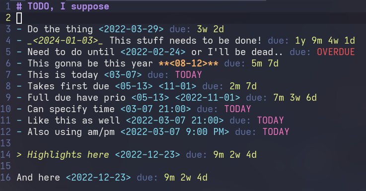
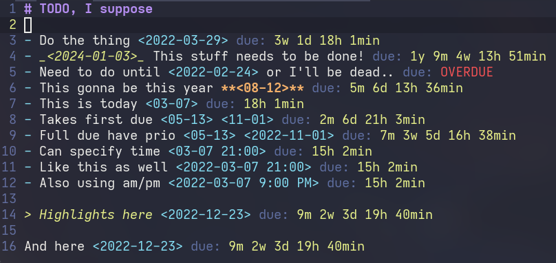

# due.nvim

Simple plugin that provides you due for the date string.





## Requirements

- Neovim 0.4.4+

## Installation

Using [packer.nvim](https://github.com/wbthomason/packer.nvim)

```lua
use {
  'NFrid/due.nvim',
  config = function()
    require('due_nvim').setup {}
  end
}
```

You may use another plugin manager, [Plug](https://github.com/junegunn/vim-plug)
for example. In that case you will still need to initialize it with lua:

```vim
lua << EOF
require('due_nvim').setup {}
EOF
```

## Settings

Pass any of these settings to setup func to overwrite the defaults:

```lua
require('due_nvim').setup {
  prescript = 'due: ',             -- prescript to due data
  prescript_hi = 'Comment',        -- highlight group of it
  due_hi = 'String',               -- highlight group of the data itself
  ft = '*.md',                     -- filename template to apply aucmds :)
  today = 'TODAY',                 -- text for today's due
  today_hi = 'Character',          -- highlight group of today's due
  overdue = 'OVERDUE',             -- text for overdued
  overdue_hi = 'Error',            -- highlight group of overdued
  date_hi = 'Conceal',             -- highlight group of date string

  pattern_start = '<',             -- start for a date string pattern
  pattern_end = '>',               -- end for a date string pattern
  -- lua patterns: in brackets are 'groups of data', their order is described
  -- accordingly. More about lua patterns: https://www.lua.org/pil/20.2.html
  date_pattern = '(%d%d)%-(%d%d)', -- m, d
  datetime_pattern = date_pattern .. ' (%d+):(%d%d)', -- m, d, h, min
  datetime12_pattern = datetime_pattern .. ' (%a%a)', -- m, d, h, min, am/pm
  fulldate_pattern = '(%d%d%d%d)%-' .. date_pattern, -- y, m, d
  fulldatetime_pattern = '(%d%d%d%d)%-' .. datetime_pattern, -- y, m, d, h, min
  fulldatetime12_pattern = fulldatetime_pattern .. ' (%a%a)', -- y, m, d, h, min, am/pm
  -- idk how to allow to define the order by config yet,
  -- but you can help me figure it out...

  regex_hi = "\\d*-*\\d\\+-\\d\\+\\( \\d*:\\d*\\( \\a\\a\\)\\?\\)\\?",
                                  -- vim regex for highlighting, notice double
                                     -- backslashes cuz lua strings escaping

  update_rate = use_clock_time and (use_seconds and 1000 or 60000) or 0,
                                  -- selects the rate due clocks will update in
                                     -- milliseconds. 0 or less disables it

  use_clock_time = false,         -- display also hours and minutes
  use_clock_today = false,        -- do it instead of TODAY
  use_seconds = false,            -- if use_clock_time == true, display seconds
                                     -- as well
  default_due_time = "midnight"   -- if use_clock_time == true, calculate time
                                     -- until option on specified date. Accepts
                                     -- "midnight", for 23:59:59, or noon, for
                                     -- 12:00:00
}
```

## Functions

These are used to make it work..

```lua
require("due_nvim").draw(0)   -- Draws it for a buffer (0 to current)
require("due_nvim").clean(0)  -- Cleans the array from it
require("due_nvim").redraw(0) -- Cleans, then draws
require("due_nvim").async_update(0) -- Runs the async update function (needs update_rate > 0)
```
